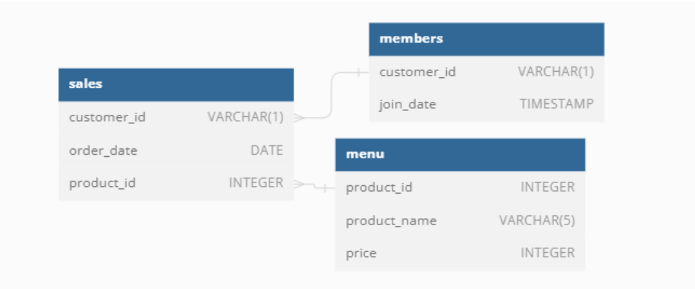

# Case Study #1 - Danny's Diner


---

## Table of Contents

- [Problem Statement](##Problem-Statement)
- [Entity Relationship Diagram](##Entity-Relationship-Diagram)
- [SQL Queries and Outputs](##SQL-Queries-and-Outputs)

## Problem Statement

Danny seriously loves Japanese food so in the beginning of 2021, he decides to embark upon a risky venture and opens up a cute little restaurant that sells his 3 favourite foods: sushi, curry and ramen.

Danny’s Diner is in need of your assistance to help the restaurant stay afloat - the restaurant has captured some very basic data from their few months of operation but have no idea how to use their data to help them run the business.

Danny wants to use the data to answer a few simple questions about his customers, especially about their visiting patterns, how much money they’ve spent and also which menu items are their favourite. Having this deeper connection with his customers will help him deliver a better and more personalised experience for his loyal customers.

He plans on using these insights to help him decide whether he should expand the existing customer loyalty program - additionally he needs help to generate some basic datasets so his team can easily inspect the data without needing to use SQL.

Danny has provided you with a sample of his overall customer data due to privacy issues - but he hopes that these examples are enough for you to write fully functioning SQL queries to help him answer his questions!

Danny has shared with you 3 key datasets for this case study:

- `sales`
- `menu`
- `members`

---

## Entity Relationship Diagram



---

## SQL Queries and Outputs

### 1. What is the total amount each customer spent at the restaurant?

```sql
SELECT SALES.customer_id, SUM(MENU.price) as Total_amt_spend
FROM SALES
LEFT JOIN MENU ON
SALES.product_id = MENU.product_id
GROUP BY SALES.customer_id
ORDER BY SUM(SALES.customer_id) ASC;
```

Output:
| customer_id | Total_amt_spend |
|-------------|------------------|
| A | 76 |
| B | 74 |
| C | 36 |

### 2. How many days has each customer visited the restaurant?

```sql
SELECT SALES.customer_id, SUM(MENU.price) as Total_amt_spend
FROM SALES
LEFT JOIN MENU ON
SALES.product_id = MENU.product_id
GROUP BY SALES.customer_id
ORDER BY SUM(SALES.customer_id) ASC;
```

Output:
| customer_id | number_of_visits |
|-------------|-------------------|
| A | 4 |
| B | 6 |
| C | 2 |

### 3. What was the first item from the menu purchased by each customer?

```sql
WITH item_purchased_by_customer
as (SELECT
	SALES.customer_id as customer_id,
    SALES.order_date as order_date,
    MENU.product_name as product_name,
    DENSE_RANK() OVER (PARTITION BY SALES.customer_id ORDER BY SALES.order_date) as `Dense_Rank`
    FROM SALES
    LEFT JOIN MENU ON
    SALES.product_id = MENU.product_id
    )
SELECT customer_id,
		product_name
        FROM item_purchased_by_customer
WHERE `Dense_Rank` = 1
GROUP BY customer_id, product_name;
```

Output:
| customer_id | product_name |
|-------------|--------------|
| A | sushi |
| A | curry |
| B | curry |
| C | ramen |

### 4. What is the most purchased item on the menu and how many times was it purchased by all customers?

```sql
SELECT MENU.product_name,
	COUNT(SALES.customer_id) as item_count
FROM MENU
INNER JOIN SALES ON
MENU.product_id = SALES.product_id
GROUP BY MENU.product_name
ORDER BY item_count DESC
LIMIT 1;
```

Output:
| product_name | item_count |
|--------------|------------|
| ramen | 8 |

### 5. Which item was the most popular for each customer?

```sql
WITH most_popular
AS (SELECT SALES.customer_id,
		MENU.product_name,
        COUNT(MENU.product_name) AS order_cnt,
        DENSE_RANK() OVER (PARTITION BY SALES.customer_id ORDER BY COUNT(SALES.customer_id) DESC) as `Dense_Rank`
        FROM SALES JOIN MENU ON
        MENU.product_id = SALES.product_id
        GROUP BY SALES.customer_id, MENU.product_name
	)
SELECT customer_id, product_name, order_cnt
FROM most_popular
WHERE `Dense_Rank` = 1;
```

Output:
| customer_id | product_name | order_cnt |
|-------------|--------------|-----------|
| A | ramen | 3 |
| B | curry | 2 |
| B | sushi | 2 |
| B | ramen | 2 |
| C | ramen | 3 |

### 6. Which item was purchased first by the customer after they became a member?

```sql
WITH first_item_purchased AS (
SELECT
    MEMBERS.customer_id AS customer_id,
    SALES.product_id AS product_id,
    DENSE_RANK() OVER (PARTITION BY MEMBERS.customer_id ORDER BY SALES.order_date ASC) AS DRank
    FROM MEMBERS
    JOIN SALES ON SALES.customer_id = MEMBERS.customer_id AND SALES.order_date > MEMBERS.join_date
)
SELECT
    first_item_purchased.customer_id AS customer_id,
    MENU.product_name
FROM first_item_purchased
JOIN MENU ON first_item_purchased.product_id = MENU.product_id
WHERE Drank = 1
ORDER BY customer_id ASC;
```

Output:
| customer_id | product_name |
|-------------|--------------|
| A | ramen |
| B | sushi |

### 7. Which item was purchased just before the customer became a member?

```sql
WITH first_item_purchased AS (
SELECT
    MEMBERS.customer_id AS customer_id,
    SALES.product_id AS product_id,
    DENSE_RANK() OVER (PARTITION BY MEMBERS.customer_id ORDER BY SALES.order_date DESC) AS DRank
FROM MEMBERS
JOIN SALES ON SALES.customer_id = MEMBERS.customer_id AND SALES.order_date < MEMBERS.join_date
)
SELECT
    first_item_purchased.customer_id AS customer_id,
    MENU.product_name
FROM first_item_purchased
JOIN MENU ON first_item_purchased.product_id = MENU.product_id
WHERE Drank = 1
ORDER BY customer_id ASC;
```

Output:
| customer_id | product_name |
|-------------|--------------|
| A | sushi |
| A | curry |
|B | sushi |

### 8. What is the total items and amount spent for each member before they became a member?

```sql
SELECT SALES.customer_id,
		COUNT(SALES.product_id) AS total_items_purchased,
        SUM(MENU.price) AS amount_spent
FROM SALES
INNER JOIN MEMBERS
ON SALES.customer_id = MEMBERS.customer_id AND SALES.order_date < MEMBERS.join_date
JOIN MENU
ON MENU.product_id = SALES.product_id
GROUP BY SALES.customer_id
ORDER BY SALES.customer_id;
```

Output:
| customer_id | total_items_purchased | amount_spent |
|-------------|------------------------|--------------|
| A | 2 | 25 |
| B | 3 | 40 |

### 9. If each $1 spent equates to 10 points and sushi has a 2x points multiplier how many points would each customer have?

```sql
WITH cte AS (
SELECT
	MENU.product_id,
	(CASE WHEN MENU.product_name = 'sushi' THEN 20 * MENU.price
    ELSE 10 * MENU.price END) AS Points
    FROM MENU)
SELECT SALES.customer_id AS Customer_Id,
	SUM(cte.points) AS Total_Points
FROM SALES LEFT JOIN cte ON
SALES.product_id = cte.product_id
GROUP BY SALES.customer_id
ORDER BY SALES.customer_id;
```

Output:
| customer_id | Total_Points |
|-------------|--------------|
| A | 860 |
| B | 940 |
| C | 360 |

### 10. In the first week after a customer joins the program (including their join date) they earn 2x points on all items, not just sushi how many points do customer A and B have at the end of January?

```sql
WITH dates_cte AS (
SELECT customer_id, join_date,
	DATE_ADD(join_date, INTERVAL 6 DAY) AS valid_date,
    LAST_DAY('2021-01-01') AS month_end_date
    FROM members
) SELECT DC.customer_id,
	SUM(CASE WHEN S.order_date BETWEEN DC.join_date AND DC.valid_date THEN M.price * 20
			 WHEN M.product_name = 'sushi' THEN M.price * 20
             ELSE M.price * 10 END) AS total_points
FROM dates_cte AS DC
JOIN sales AS S
ON DC.customer_id = S.customer_id
JOIN menu AS M
ON M.product_id = S.product_id
WHERE S.order_date <= DC.month_end_date
GROUP BY DC.customer_id;
```

Output:
| customer_id | total_points |
|-------------|--------------|
| B | 820 |
| A | 1370 |

## BONUS QUESTIONS:

### Part 1 - Join All The Things: Recreate the table with: customer_id, order_date, product_name, price, member (Y/N) that looks like the below:

Desired Table:
| customer_id | order_date | product_name | price | Member |
|-------------|------------|---------------|-------|--------|
| A | 2021-01-01 | sushi | 10 | N |
| A | 2021-01-01 | curry | 15 | N |
| A | 2021-01-07 | curry | 15 | Y |
| A | 2021-01-10 | ramen | 12 | Y |
| A | 2021-01-11 | ramen | 12 | Y |
| A | 2021-01-11 | ramen | 12 | Y |
| B | 2021-01-01 | curry | 15 | N |
| B | 2021-01-02 | curry | 15 | N |
| B | 2021-01-04 | sushi | 10 | N |
| B | 2021-01-11 | sushi | 10 | Y |
| B | 2021-01-16 | ramen | 12 | Y |
| B | 2021-02-01 | ramen | 12 | Y |
| C | 2021-01-01 | ramen | 12 | N |
| C | 2021-01-01 | ramen | 12 | N |
| C | 2021-01-07 | ramen | 12 | N |

```sql
SELECT
	SALES.customer_id,
	SALES.order_date,
	MENU.product_name,
    MENU.price,
    CASE WHEN SALES.order_date >= MEMBERS.join_date THEN 'Y' ELSE 'N' END AS `Member`
FROM SALES LEFT JOIN MEMBERS ON
SALES.customer_id = MEMBERS.customer_id
JOIN MENU ON
SALES.product_id = MENU.product_id
ORDER BY SALES.customer_id ASC, SALES.order_date ASC;
```

Output:
| customer_id | order_date | product_name | price | Member |
|-------------|------------|---------------|-------|--------|
| A | 2021-01-01 | sushi | 10 | N |
| A | 2021-01-01 | curry | 15 | N |
| A | 2021-01-07 | curry | 15 | Y |
| A | 2021-01-10 | ramen | 12 | Y |
| A | 2021-01-11 | ramen | 12 | Y |
| A | 2021-01-11 | ramen | 12 | Y |
| B | 2021-01-01 | curry | 15 | N |
| B | 2021-01-02 | curry | 15 | N |
| B | 2021-01-04 | sushi | 10 | N |
| B | 2021-01-11 | sushi | 10 | Y |
| B | 2021-01-16 | ramen | 12 | Y |
| B | 2021-02-01 | ramen | 12 | Y |
| C | 2021-01-01 | ramen | 12 | N |
| C | 2021-01-01 | ramen | 12 | N |
| C | 2021-01-07 | ramen | 12 | N |

### Part 2 - Rank All The Things: Danny also requires further information about the ranking of customer products, but he purposely does not need the ranking for non-member purchases so he expects null ranking values for the records when customers are not yet part of the loyalty program.:

Desired Table:
| customer_id | order_date | product_name | price | Member | ranking |
|-------------|------------|---------------|-------|--------|---------|
| A | 2021-01-01 | sushi | 10 | N | null |
| A | 2021-01-01 | curry | 15 | N | null |
| A | 2021-01-07 | curry | 15 | Y | 1 |
| A | 2021-01-10 | ramen | 12 | Y | 2 |
| A | 2021-01-11 | ramen | 12 | Y | 3 |
| A | 2021-01-11 | ramen | 12 | Y | 3 |
| B | 2021-01-01 | curry | 15 | N | null |
| B | 2021-01-02 | curry | 15 | N | null |
| B | 2021-01-04 | sushi | 10 | N | null |
| B | 2021-01-11 | sushi | 10 | Y | 1 |
| B | 2021-01-16 | ramen | 12 | Y | 2 |
| B | 2021-02-01 | ramen | 12 | Y | 3 |
| C | 2021-01-01 | ramen | 12 | N | NULL |
| C | 2021-01-01 | ramen | 12 | N | NULL |
| C | 2021-01-07 | ramen | 12 | N | NULL |

```sql
WITH all_data AS (
SELECT
	SALES.customer_id, SALES.order_date, MENU.product_name, MENU.price,
    CASE WHEN SALES.order_date >= MEMBERS.join_date THEN 'Y' ELSE 'N' END AS `Member`
FROM SALES LEFT JOIN MENU ON
SALES.product_id = MENU.product_id
LEFT JOIN MEMBERS ON
SALES.customer_id = MEMBERS.customer_id)

SELECT all_data.*,
	CASE WHEN all_data.Member = 'Y' THEN RANK() OVER (PARTITION BY all_data.customer_id, all_data.member
			ORDER BY all_data.order_date) ELSE NULL
    END AS 'ranking'
FROM all_data;
```

Output:
| customer_id | order_date | product_name | price | Member | ranking |
|-------------|------------|---------------|-------|--------|---------|
| A | 2021-01-01 | sushi | 10 | N | null |
| A | 2021-01-01 | curry | 15 | N | null |
| A | 2021-01-07 | curry | 15 | Y | 1 |
| A | 2021-01-10 | ramen | 12 | Y | 2 |
| A | 2021-01-11 | ramen | 12 | Y | 3 |
| A | 2021-01-11 | ramen | 12 | Y | 3 |
| B | 2021-01-01 | curry | 15 | N | null |
| B | 2021-01-02 | curry | 15 | N | null |
| B | 2021-01-04 | sushi | 10 | N | null |
| B | 2021-01-11 | sushi | 10 | Y | 1 |
| B | 2021-01-16 | ramen | 12 | Y | 2 |
| B | 2021-02-01 | ramen | 12 | Y | 3 |
| C | 2021-01-01 | ramen | 12 | N | NULL |
| C | 2021-01-01 | ramen | 12 | N | NULL |
| C | 2021-01-07 | ramen | 12 | N | NULL |
